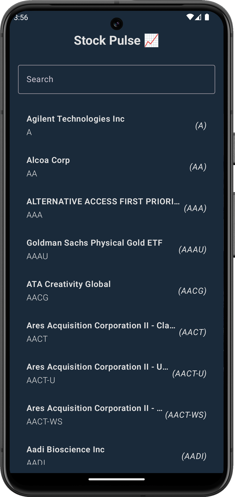
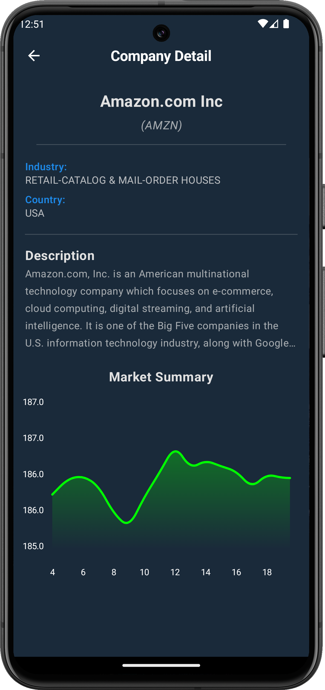

# 📈 **StockPulse**  
A modern Stock Market app built with **Jetpack Compose**, following clean architecture principles and best coding practices for maintainability, scalability, and performance.

## 📱 **Screenshots**

| Home Screen                  | Company Details                  |
|------------------------------|----------------------------------|
|  |  |


## 🚀 **Features**

- **Historical Data**: View historical stock data with interactive charts.
- **Offline Mode with Local Caching**: View cached stock data even when you're offline.

## 🛠 **Built With**

- **Jetpack Compose**: A modern toolkit for building native Android UI.
- **Clean Architecture**: Ensures separation of concerns for maintainability and testability.
- **Dependency Injection with Dagger-Hilt**: Efficient management of dependencies across the app.
- **Room**: Local database for caching stock data and providing offline functionality.
- **Retrofit**: Handles networking and API calls for fetching stock market data.
- **Coroutines & Flow**: Efficient background processing and reactive data streams.
- **Repository Pattern**: Abstraction for handling remote and local data sources.

## 📂 **Project Structure**
```
├── data
│   ├── csv
│   ├── local
│   ├── mapper
│   ├── remote
│   │   └── dto
│   └── repository
├── di
├── domain
│   ├── model
│   └── repository
├── presentation
│   ├── company_info
│   └── company_listings
├── ui
│   └── theme
└── util

```

## ⚙️ **Setup & Installation**

1. **Clone the repository**:
   ```bash
   git clone https://github.com/GouravShDev/StockPulse.git
2. Open the project in Android Studio.
3. Build and run the app on an emulator or physical device.

## 🔧 **Technologies & Tools**

- **Kotlin**
- **Jetpack Compose**
- **Dagger-Hilt**
- **Room**
- **Retrofit**
- **Coroutines & Flow**
- **ViewModel**
